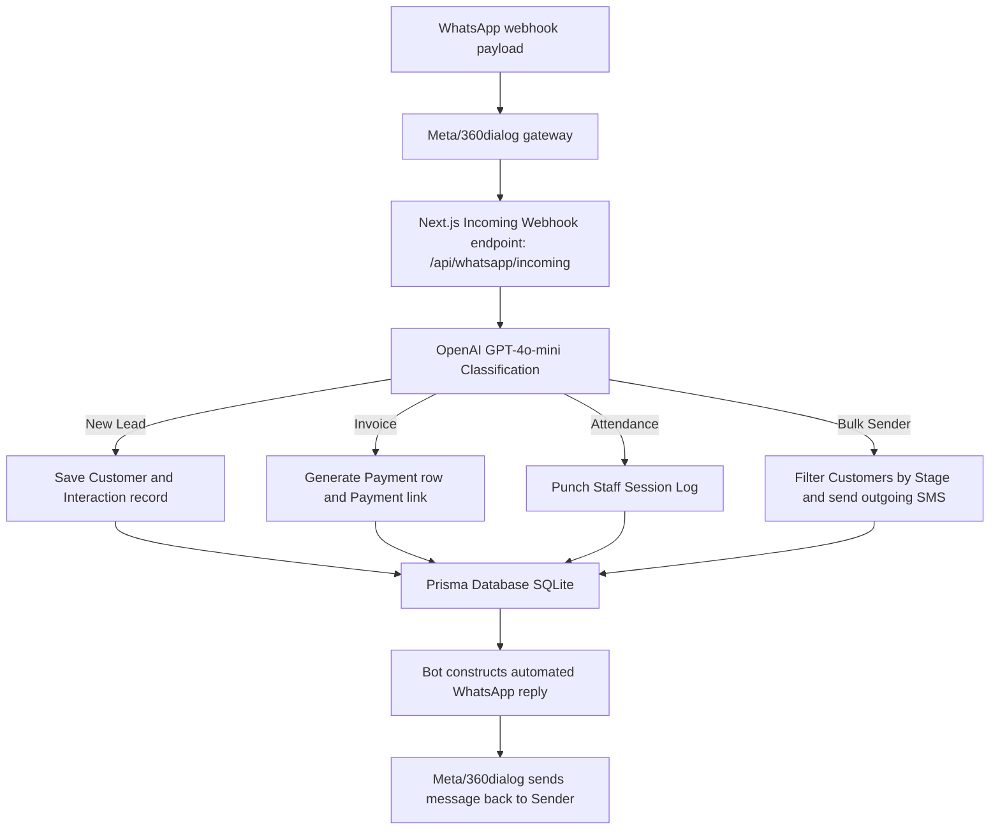
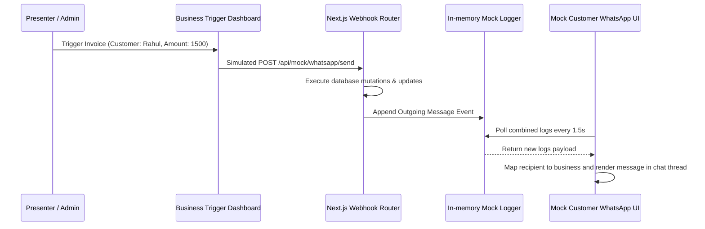

# Yaad Rakh CRM

Yaad Rakh is a standalone WhatsApp-first Customer Relationship Management system designed specifically for Indian small businesses. It enables business owners to manage leads, schedule follow-ups, track payments/udhari, broadcast segmented bulk messages, generate digital invoices, and record staff attendance entirely through a conversational WhatsApp interface, eliminating the need to install mobile apps or remember passwords.

---

## Key Capabilities

### 1. Conversational Lead Capture
Business owners can record new leads using informal messages or Hinglish voice-to-text. The AI automatically parses details such as customer name, phone number, need, budget, and follow-up timing.
* Example: "Rahul, 9876543210 ka lead save karo, budget 15k, website banana hai, 5 din baad call karna hai"

### 2. Follow-Up Reminders
The system schedules reminders based on conversational timeframes (e.g., "2 din baad", "1 hafta"). When reminders are due, the daemon fires alerts to the business owner, providing direct WhatsApp links to text the customer and interactive action buttons.

### 3. Balance & Debt (Udhari) Tracker
Allows tracking informal credits and repayments.
* Example: "Meena ka 5000 baaki hai" (logs a debt)
* Example: "Ramesh ne 3000 diya aaj" (updates balance)

### 4. Segmented Bulk Messaging
Allows broadcasting festival greetings, shop updates, or customized messages to specific customer segments filtered by pipeline stage (e.g., new, interested, negotiating, won, lost).
* Example: "won leads ko Happy Diwali wish send karo"

### 5. Digital Bills & Invoices
Instantly generates digital bills with item details, amount, and simulated online transaction payment links, automatically sending the invoice statement to the customer.
* Example: "Rahul digital bill of 3200 for leather shoes"

### 6. Staff Session Logging
Tracks staff daily check-ins and check-outs for operational audits.
* Example: "Ramesh staff punch in"

---

## Technical Stack

* **Core Framework:** Next.js 15 (App Router)
* **Language:** TypeScript
* **Database Layer:** Prisma ORM with SQLite (local development)
* **Natural Language Processing:** OpenAI GPT-4o-mini (Message classification and parameter extraction)
* **Communication Interface:** WhatsApp Cloud API (via 360dialog gateway)

---

## System Architecture



### Client Demo Flow



---

## Configuration & Setup

Create a `.env` file in the root directory:

```env
# Database Connection
DATABASE_URL="file:./prisma/dev.db"

# OpenAI Access Credentials
OPENAI_API_KEY="your-openai-api-key"

# WhatsApp Meta API Settings
WHATSAPP_API_KEY="your-360dialog-api-key"
WHATSAPP_PHONE_NUMBER_ID="your-phone-number-id"
WHATSAPP_VERIFY_TOKEN="your-verify-token"
WHATSAPP_BOT_NUMBER="your-virtual-bot-number"

# Application Settings
NEXT_PUBLIC_APP_NAME="Yaad Rakh"
```

### Database Initialization

To set up your database tables, run:

```bash
npx prisma generate
npx prisma db push
```

---

## Run Locally

Run the Next.js development server:

```bash
npm run dev
```

Open [http://localhost:3000](http://localhost:3000) to view the homepage.

To inspect mock logs, simulated text prompts, database side effects, and incoming webhook payloads, visit the dedicated receiver-side console at `/parser`.
